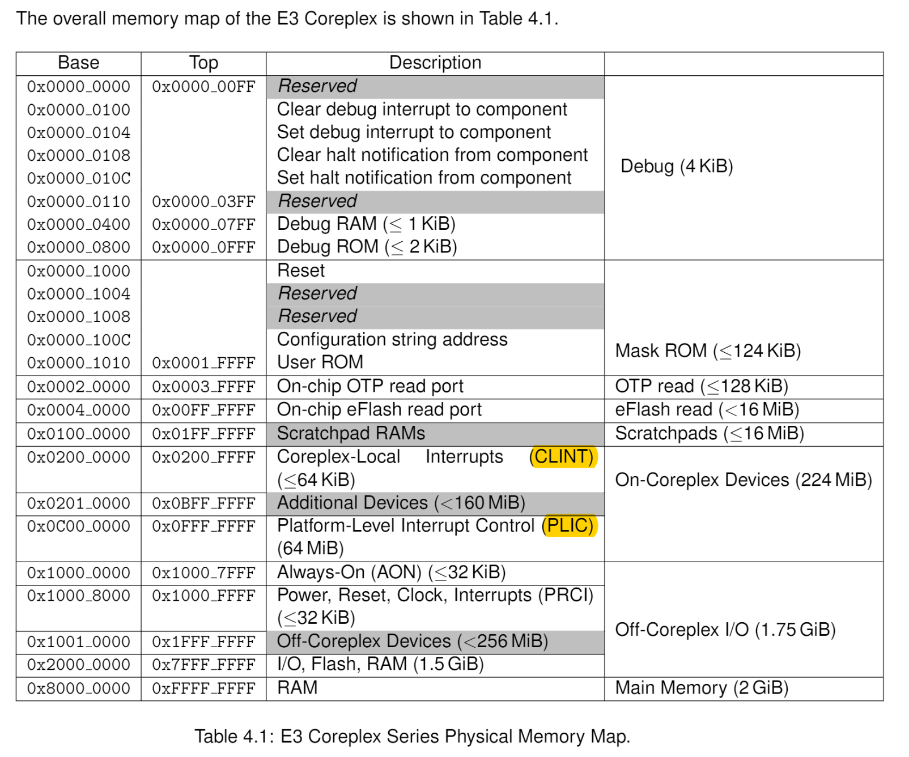

# Spike

Spike是RISC-V的一种仿真器，它可以仿真一个或多个hart

目前它支持的RISC-V指令集特性有：

```
RV32I and RV64I base ISAs, v2.1
Zifencei extension, v2.0
Zicsr extension, v2.0
M extension, v2.0
A extension, v2.1
F extension, v2.2
D extension, v2.2
Q extension, v2.2
C extension, v2.0
V extension, v0.9-draft-20200403, w/ Zvlsseg, w/o Zvamo/Zvediv, (requires a 64-bit host)
Conformance to both RVWMO and RVTSO (Spike is sequentially consistent)
Machine, Supervisor, and User modes, v1.11
Debug v0.14
```

Spike是官方的对RISC-V的仿真实现，可以说是指令的事实标准（支持手册上的所有指令）

## Spike的使用

- 作为裸机使用
- 结合pk（代理内核），可以直接运行C程序

## Spike项目的目录结构

```
-------------------------------------------------------------------------------
Language                     files          blank        comment           code
-------------------------------------------------------------------------------
C/C++ Header                   637           1216           3525          13825
C                              219           3102           6563           9496
Bourne Shell                     7            973           1352           7682
C++                             41           1182            281           7615
m4                               8            101              0            556
Python                           2             21              9            112
Assembly                         2             11             25             48
make                             1              8              2             14
-------------------------------------------------------------------------------
SUM:                           917           6614          11757          39348
-------------------------------------------------------------------------------
```

其中，Spike的主体为C++代码编写，主要文件夹为`riscv`和`spike_main`

```
debug_rom/
dummy_rocc/
fesvr/
riscv/
scripts/
softfloat/
spike_main/
tests/
```

其中`riscv`文件夹为仿真部分，用于模拟RISC-V指令，`spike_main`主要用于与用户交互，例如启动之前的参数选项，反汇编等。

### 其他一些文件夹的用处

- `fesvr`文件夹

该文件夹原本是一个独立于Spike的项目，为RISC-V Frontend Server，目前已为Archived状态

这里面有个比较重要的东西，为`htif`（hart interface）的实现，用于与主机交互，例如，`printf`

*未证实：这个机制似乎要被废弃，tohost与fromhost原本是属于CSR寄存器的，但早被删除*

- `softfloat`文件夹

该文件夹就是该项目存在大量C语言代码的原因，用于实现软浮点

这个文件夹本身不是Spike项目中实现的，而是取自Berkeley SoftFloat

## riscv文件夹

- processor.cc processor.h

作为一个仿真器，很容易想到，我们应该从这两个文件开始分析，因为spike还是基于硬件进行模拟

该文件中显然`class processor_t`这个类是核心，这个类比较长，大概有250行

先分析构造函数

```c++
  processor_t(const char* isa, const char* priv, const char* varch,
              simif_t* sim, uint32_t id, bool halt_on_reset,
              FILE *log_file);
```

`isa`为指定指令集，默认是 RV64IMAFDC

`priv`为支持的特权，默认是MSU

`varch`为vector寄存器的设置

`sim`的类型是`simif_t*`，该类型主要是一些仿真接口，定义在`simif.h`

`id`为处理器id号，是否就是hart的id？

`halt_on_reset` 该选项用于指示启动时是否运行，应该就是`-d`选项的实现

`log_file` 该参数疑似新添加的，应该用于存放一些log信息


接下来看看它的一些私有成员

```c++
private:
  simif_t* sim;
  mmu_t* mmu; // main memory is always accessed via the mmu
  extension_t* ext;
  disassembler_t* disassembler;
  state_t state;
  uint32_t id;
  unsigned max_xlen;
  unsigned xlen;
  reg_t max_isa;
  std::string isa_string;
  bool histogram_enabled;
  bool log_commits_enabled;
  FILE *log_file;
  bool halt_on_reset;
  std::vector<bool> extension_table;
...
```

可以看到，用于仿真所需的一些参数，其中，比较重要的是state变量，找到它的类型定义

```c++
struct state_t
{
  void reset(reg_t max_isa);

  static const int num_triggers = 4;

  reg_t pc;
  regfile_t<reg_t, NXPR, true> XPR;
  regfile_t<freg_t, NFPR, false> FPR;

  // control and status registers
  reg_t prv;    // TODO: Can this be an enum instead?
  reg_t misa;
  reg_t mstatus;
  reg_t mepc;
  reg_t mtval;
  reg_t mscratch;
  reg_t mtvec;
  reg_t mcause;
  reg_t minstret;
  reg_t mie;
  reg_t mip;
  reg_t medeleg;
  reg_t mideleg;
  uint32_t mcounteren;
  uint32_t scounteren;
  reg_t sepc;
  reg_t stval;
  reg_t sscratch;
  reg_t stvec;
  reg_t satp;
  reg_t scause;

  reg_t dpc;
  reg_t dscratch0, dscratch1;
  dcsr_t dcsr;
  reg_t tselect;
  mcontrol_t mcontrol[num_triggers];
  reg_t tdata2[num_triggers];
  bool debug_mode;

  static const int n_pmp = 16;
  uint8_t pmpcfg[n_pmp];
  reg_t pmpaddr[n_pmp];

  uint32_t fflags;
  uint32_t frm;
  bool serialized; // whether timer CSRs are in a well-defined state

  // When true, execute a single instruction and then enter debug mode.  This
  // can only be set by executing dret.
  enum {
      STEP_NONE,
      STEP_STEPPING,
      STEP_STEPPED
  } single_step;

#ifdef RISCV_ENABLE_COMMITLOG
  commit_log_reg_t log_reg_write;
  commit_log_mem_t log_mem_read;
  commit_log_mem_t log_mem_write;
  reg_t last_inst_priv;
  int last_inst_xlen;
  int last_inst_flen;
#endif
};
```

可以看出，该结构体定义的正是RISC-V指令集中的一些常用寄存器，包括通用整数寄存器，浮点寄存器，以及pc和一些CSR寄存器


同时，注意到`processor_t`类是继承自`abstract_device_t`类，该类非常短

```c++
class abstract_device_t {
 public:
  virtual bool load(reg_t addr, size_t len, uint8_t* bytes) = 0;
  virtual bool store(reg_t addr, size_t len, const uint8_t* bytes) = 0;
  virtual ~abstract_device_t() {}
};
```

也就是load和store两个虚函数，定义在`devices.h`中，可以看到该文件中定义了多种设备类，例如`bus`,`mem`,`rom`,`clint`等，其中，`clint`又是一个有必要提及的东西，后面再讲


- `insn`文件夹、指令的处理过程

该文件夹用于存放各种指令的实现

打开后可以发现只有一行或者少数几行，显然，实际指令执行的代码还需要生成

观察各文件名可以发现，`insn_template.cc`应该是实际模板

```c++
reg_t rv32_NAME(processor_t* p, insn_t insn, reg_t pc)
{
  int xlen = 32;
  reg_t npc = sext_xlen(pc + insn_length(OPCODE));
  #include "insns/NAME.h"
  trace_opcode(p, OPCODE, insn);
  return npc;
}

reg_t rv64_NAME(processor_t* p, insn_t insn, reg_t pc)
{
  int xlen = 64;
  reg_t npc = sext_xlen(pc + insn_length(OPCODE));
  #include "insns/NAME.h"
  trace_opcode(p, OPCODE, insn);
  return npc;
}
```

可以发现，这两个函数中各有`#include`，显然就是将`insns`文件夹中的文件内容导入到这两个函数模板中

此时发现另一个问题，指令的模拟有了，Spike又是如何运行指令的

自然而然想到`execute.cc`文件

```c++
static reg_t execute_insn(processor_t* p, reg_t pc, insn_fetch_t fetch)
{
  commit_log_reset(p);
  commit_log_stash_privilege(p);
  reg_t npc;

  try {
    npc = fetch.func(p, fetch.insn, pc);
    if (npc != PC_SERIALIZE_BEFORE) {

#ifdef RISCV_ENABLE_COMMITLOG
      if (p->get_log_commits_enabled()) {
        commit_log_print_insn(p, pc, fetch.insn);
      }
#endif

     }
#ifdef RISCV_ENABLE_COMMITLOG
  } catch(mem_trap_t& t) {
      //handle segfault in midlle of vector load/store
      if (p->get_log_commits_enabled()) {
        for (auto item : p->get_state()->log_reg_write) {
          if ((item.first & 3) == 3) {
            commit_log_print_insn(p, pc, fetch.insn);
            break;
          }
        }
      }
      throw;
#endif
  } catch(...) {
    throw;
  }
  p->update_histogram(pc);

  return npc;
}
```

显然，我们需要关心的语句只有一条，即`npc = fetch.func(p, fetch.insn, pc);`

这就把问题重新定位到`insn_fetch_t`类的实现

找到发现在`mmu.h`文件夹中

```c++
struct insn_fetch_t
{
  insn_func_t func;
  insn_t insn;
};
```

此时定位到需要知道`insn_t`的描述，通过搜索，找到定义实现在`decode.h`中

找到后我们发现了一些RISC-V中熟悉的东西

```c++
class insn_t
{
public:
  insn_t() = default;
  insn_t(insn_bits_t bits) : b(bits) {}
  insn_bits_t bits() { return b; }
  int length() { return insn_length(b); }
  int64_t i_imm() { return int64_t(b) >> 20; }
  int64_t shamt() { return x(20, 6); }
  int64_t s_imm() { return x(7, 5) + (xs(25, 7) << 5); }
  int64_t sb_imm() { return (x(8, 4) << 1) + (x(25,6) << 5) + (x(7,1) << 11) + (imm_sign() << 12); }
  int64_t u_imm() { return int64_t(b) >> 12 << 12; }
  int64_t uj_imm() { return (x(21, 10) << 1) + (x(20, 1) << 11) + (x(12, 8) << 12) + (imm_sign() << 20); }
  uint64_t rd() { return x(7, 5); }
  uint64_t rs1() { return x(15, 5); }
  uint64_t rs2() { return x(20, 5); }
  uint64_t rs3() { return x(27, 5); }
  uint64_t rm() { return x(12, 3); }
  uint64_t csr() { return x(20, 12); }

  int64_t rvc_imm() { return x(2, 5) + (xs(12, 1) << 5); }
  int64_t rvc_zimm() { return x(2, 5) + (x(12, 1) << 5); }
  int64_t rvc_addi4spn_imm() { return (x(6, 1) << 2) + (x(5, 1) << 3) + (x(11, 2) << 4) + (x(7, 4) << 6); }
  int64_t rvc_addi16sp_imm() { return (x(6, 1) << 4) + (x(2, 1) << 5) + (x(5, 1) << 6) + (x(3, 2) << 7) + (xs(12, 1) << 9); }
  int64_t rvc_lwsp_imm() { return (x(4, 3) << 2) + (x(12, 1) << 5) + (x(2, 2) << 6); }
  int64_t rvc_ldsp_imm() { return (x(5, 2) << 3) + (x(12, 1) << 5) + (x(2, 3) << 6); }
  int64_t rvc_swsp_imm() { return (x(9, 4) << 2) + (x(7, 2) << 6); }
  int64_t rvc_sdsp_imm() { return (x(10, 3) << 3) + (x(7, 3) << 6); }
  int64_t rvc_lw_imm() { return (x(6, 1) << 2) + (x(10, 3) << 3) + (x(5, 1) << 6); }
  int64_t rvc_ld_imm() { return (x(10, 3) << 3) + (x(5, 2) << 6); }
  int64_t rvc_j_imm() { return (x(3, 3) << 1) + (x(11, 1) << 4) + (x(2, 1) << 5) + (x(7, 1) << 6) + (x(6, 1) << 7) + (x(9, 2) << 8) + (x(8, 1) << 10) + (xs(12, 1) << 11); }
  int64_t rvc_b_imm() { return (x(3, 2) << 1) + (x(10, 2) << 3) + (x(2, 1) << 5) + (x(5, 2) << 6) + (xs(12, 1) << 8); }
  int64_t rvc_simm3() { return x(10, 3); }
  uint64_t rvc_rd() { return rd(); }
  uint64_t rvc_rs1() { return rd(); }
  uint64_t rvc_rs2() { return x(2, 5); }
  uint64_t rvc_rs1s() { return 8 + x(7, 3); }
  uint64_t rvc_rs2s() { return 8 + x(2, 3); }

  uint64_t v_vm() { return x(25, 1); }
  uint64_t v_nf() { return x(29, 3); }
  uint64_t v_simm5() { return xs(15, 5); }
  uint64_t v_zimm5() { return x(15, 5); }
  uint64_t v_zimm11() { return x(20, 11); }
  uint64_t v_lmul() { return 1 << x(20, 2); }
  uint64_t v_sew() { return 1 << (x(22, 3) + 3); }

private:
  insn_bits_t b;
  uint64_t x(int lo, int len) { return (b >> lo) & ((insn_bits_t(1) << len)-1); }
  uint64_t xs(int lo, int len) { return int64_t(b) << (64-lo-len) >> (64-len); }
  uint64_t imm_sign() { return xs(63, 1); }
};
```

显然该类中定义了大量的解码操作，因为与verilog设计不同，所以取相关位时用了大量的位运算操作

可以看到，大部分函数中都用到了`x`操作，这个操作就是从第lo位开始，去长度为len的位

这时，需要知道另一个`insn_func_t`的定义，发现定义在`process.h`中

```c++
typedef reg_t (*insn_func_t)(processor_t*, insn_t, reg_t);
```

发现是一个函数指针，看来需要从其他地方入手

这时显然需要知道传入的参数到底是什么，那么就去找该函数在哪被调用

发现在`void processor_t::step(size_t n)`这个函数中被调用，但这个函数异常地长，不好分析。

这也是循环执行指令的函数，找到被调用的地方

```c++
insn_fetch_t fetch = mmu->load_insn(pc);
if (debug && !state.serialized)
    disasm(fetch.insn);
pc = execute_insn(this, pc, fetch);
advance_pc();
```

显然，这时问题又回到了`mmu`，找到

```c++
inline insn_fetch_t load_insn(reg_t addr)
{
    icache_entry_t entry;
    return refill_icache(addr, &entry)->data;
}
```

问题似乎越来越复杂，再次定位，找到

```c++
  inline icache_entry_t* refill_icache(reg_t addr, icache_entry_t* entry)
  {
    auto tlb_entry = translate_insn_addr(addr);
    insn_bits_t insn = from_le(*(uint16_t*)(tlb_entry.host_offset + addr));
    int length = insn_length(insn);

    if (likely(length == 4)) {
      insn |= (insn_bits_t)from_le(*(const int16_t*)translate_insn_addr_to_host(addr + 2)) << 16;
    } else if (length == 2) {
      insn = (int16_t)insn;
    } else if (length == 6) {
      insn |= (insn_bits_t)from_le(*(const int16_t*)translate_insn_addr_to_host(addr + 4)) << 32;
      insn |= (insn_bits_t)from_le(*(const uint16_t*)translate_insn_addr_to_host(addr + 2)) << 16;
    } else {
      static_assert(sizeof(insn_bits_t) == 8, "insn_bits_t must be uint64_t");
      insn |= (insn_bits_t)from_le(*(const int16_t*)translate_insn_addr_to_host(addr + 6)) << 48;
      insn |= (insn_bits_t)from_le(*(const uint16_t*)translate_insn_addr_to_host(addr + 4)) << 32;
      insn |= (insn_bits_t)from_le(*(const uint16_t*)translate_insn_addr_to_host(addr + 2)) << 16;
    }

    insn_fetch_t fetch = {proc->decode_insn(insn), insn};
    entry->tag = addr;
    entry->next = &icache[icache_index(addr + length)];
    entry->data = fetch;

    reg_t paddr = tlb_entry.target_offset + addr;;
    if (tracer.interested_in_range(paddr, paddr + 1, FETCH)) {
      entry->tag = -1;
      tracer.trace(paddr, length, FETCH);
    }
    return entry;
  }
```

显然，我们需要关心的是`insn_fetch_t fetch = {proc->decode_insn(insn), insn};`

发现问题又回到`processor`

```c++
insn_func_t processor_t::decode_insn(insn_t insn)
{
  // look up opcode in hash table
  size_t idx = insn.bits() % OPCODE_CACHE_SIZE;
  insn_desc_t desc = opcode_cache[idx];

  if (unlikely(insn.bits() != desc.match)) {
    // fall back to linear search
    insn_desc_t* p = &instructions[0];
    while ((insn.bits() & p->mask) != p->match)
      p++;
    desc = *p;

    if (p->mask != 0 && p > &instructions[0]) {
      if (p->match != (p-1)->match && p->match != (p+1)->match) {
        // move to front of opcode list to reduce miss penalty
        while (--p >= &instructions[0])
          *(p+1) = *p;
        instructions[0] = desc;
      }
    }

    opcode_cache[idx] = desc;
    opcode_cache[idx].match = insn.bits();
  }

  return xlen == 64 ? desc.rv64 : desc.rv32;
}
```

此时回忆一下我们最初的目的，是解析`npc = fetch.func(p, fetch.insn, pc);`的执行

也就是说，我们需要知道fetch.func到底是什么，从该函数中可以看出就是返回值

因为Spike默认是RV64，所以我们直接找`desc.rv64`

在`process.h`中发现

```c++
struct insn_desc_t
{
  insn_bits_t match;
  insn_bits_t mask;
  insn_func_t rv32;
  insn_func_t rv64;
};
```

发现`rv64`就是前面提到的函数指针，此时不得不去找`opcode_cache`

这点再往下可以专门再开一个话题，它与自定义指令也有关系，暂时先到这里

- 关于内存

虽然Spike没有任何资料说明，但是似乎实际的地址分布就是SiFive公司芯片的



通过debug模式可以看到，Spike启动时的第一条指令的地址就是`0x00001000`，另外CLINT的地址也与上表相符

CLINT为core local interrupt controlor，即核局部中断控制器，主要作用为软中断与定时器中断

`clint_t`本身定义在`devices.h`中

```c++
class clint_t : public abstract_device_t {
 public:
  clint_t(std::vector<processor_t*>&, uint64_t freq_hz, bool real_time);
  bool load(reg_t addr, size_t len, uint8_t* bytes);
  bool store(reg_t addr, size_t len, const uint8_t* bytes);
  size_t size() { return CLINT_SIZE; }
  void increment(reg_t inc);
 private:
  typedef uint64_t mtime_t;
  typedef uint64_t mtimecmp_t;
  typedef uint32_t msip_t;
  std::vector<processor_t*>& procs;
  uint64_t freq_hz;
  bool real_time;
  uint64_t real_time_ref_secs;
  uint64_t real_time_ref_usecs;
  mtime_t mtime;
  std::vector<mtimecmp_t> mtimecmp;
};
```

可以看到，主要多了的成员为`mtime`,`mtimecmp`

RISC-V特权级手册中提到，这两个是用于定时器中断的，一开始为CSR寄存器，目前已被改为Memory Map

`clint`中除了`load`和`store`，还有另一个函数

```c++
void clint_t::increment(reg_t inc)
{
  if (real_time) {
   struct timeval now;
   uint64_t diff_usecs;

   gettimeofday(&now, NULL);
   diff_usecs = ((now.tv_sec - real_time_ref_secs) * 1000000) + (now.tv_usec - real_time_ref_usecs);
   mtime = diff_usecs * freq_hz / 1000000;
  } else {
    mtime += inc;
  }
  for (size_t i = 0; i < procs.size(); i++) {
    procs[i]->state.mip &= ~MIP_MTIP;
    if (mtime >= mtimecmp[i])
      procs[i]->state.mip |= MIP_MTIP;
  }
}
```

不难发现，该函数用于实现定时器中断，在每次step后也会执行一次，即增加`mtime`

完成后会对比各个核心的`mtimecmp`，如果触发中断，就对mip进行相应的置位

- HTIF

这个部分是现在fesvr文件夹中，对Spike而言它的主要功能就是I/O

因为对于仿真器而言，它至少得能和终端进行交互

当然fesvr并不只是实现HTIF，还包括加载ELF文件等功能


如果想使用这个功能，只需要定义`tohost`域`fromhost`这两个全局变量，`htif_t`类的声明中有这么一段

```c++
  addr_t tohost_addr;
  addr_t fromhost_addr;
```

根据推测，这两个地址的获取应该是直接从ELF文件中的段表中得来的

从它的构造函数中可以发现

```c++
htif_t::htif_t()
  : mem(this), entry(DRAM_BASE), sig_addr(0), sig_len(0),
    tohost_addr(0), fromhost_addr(0), exitcode(0), stopped(false),
    syscall_proxy(this)
{
  signal(SIGINT, &handle_signal);
  signal(SIGTERM, &handle_signal);
  signal(SIGABRT, &handle_signal); // we still want to call static destructors
}

htif_t::htif_t(int argc, char** argv) : htif_t()
{
  parse_arguments(argc, argv);
  register_devices();
}

htif_t::htif_t(const std::vector<std::string>& args) : htif_t()
{
  int argc = args.size() + 1;
  char * argv[argc];
  argv[0] = (char *) "htif";
  for (unsigned int i = 0; i < args.size(); i++) {
    argv[i+1] = (char *) args[i].c_str();
  }

  parse_arguments(argc, argv);
  register_devices();
}
```

构造函数中对`tohost`和`fromhost`先初始化为0

本想从中找出这两个地址到底如何初始化，没有进展，就直接搜索这两个变量，发现

```c++
void htif_t::load_program()
{
  std::map<std::string, uint64_t> symbols = load_payload(targs[0], &entry);

  if (symbols.count("tohost") && symbols.count("fromhost")) {
    tohost_addr = symbols["tohost"];
    fromhost_addr = symbols["fromhost"];
  } else {
    fprintf(stderr, "warning: tohost and fromhost symbols not in ELF; can't communicate with target\n");
  }

  // detect torture tests so we can print the memory signature at the end
  if (symbols.count("begin_signature") && symbols.count("end_signature"))
  {
    sig_addr = symbols["begin_signature"];
    sig_len = symbols["end_signature"] - sig_addr;
  }

  for (auto payload : payloads)
  {
    reg_t dummy_entry;
    load_payload(payload, &dummy_entry);
  }
}
```

发现正是从符号中直接获得的

自此还有另一个问题，如何通过tohost与fromhost与host进行通信

然而找不到任何相关资料，但是通过搜索，发现这个问题在issues中有人已经提问过，并且Waterman给出了简略的使用方法。同时，他也提到，这个部分并不是RISC-V标准，而是ucb标准，同时，他也提出，我们可以链接自己的设备来实现I/O。

63:56位代表设备

55:48位代表命令

设备0是系统调用设备，用于模拟Unix系统调用，它只实现命令0，这个命令有两个子功能

- 如果位0被清除，那么47:0位代表syscall的结构指针
- 如果位0被置位，那么47:1位代表退出代码，0表示成功，其他表示失败

Waterman也表示这是一个不好的设计

设备1是块字符设备

命令0读取一个字符

命令1向tohost写入一个字符，在最低有效字节的位置